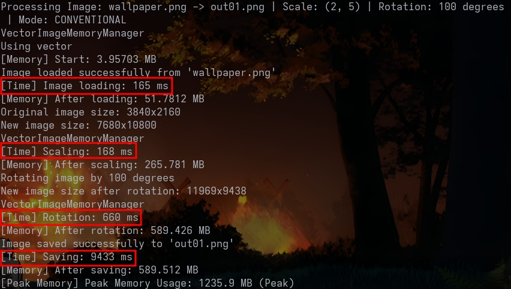
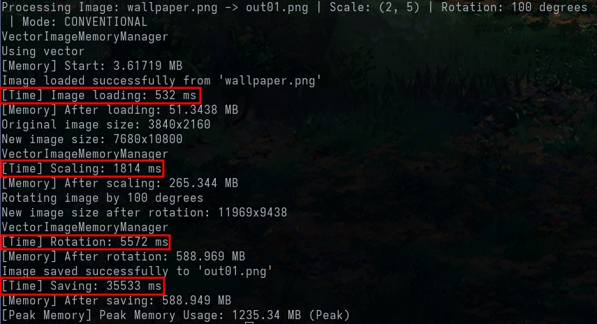

# Image Processing

Una herramienta simple de línea de comandos para rotar y escalar imágenes usando C++.

## Características

- Rotación de imágenes en ángulos específicos
- Escalado de imágenes a diferentes tamaños
- Soporte para múltiples formatos de imagen (PNG, JPEG, BMP)
- Interfaz de línea de comandos fácil de usar
- Manejo de memoria eficiente
- Procesamiento optimizado usando **OpenMP** en funciones como rotación, escalado, carga y guardado de imágenes

## Requisitos

- Compilador de C++ (g++ recomendado)
- Make
- OpenMP

## Instalación

1. Clona el repositorio:
    ```
    git clone https://github.com/JuanM0412/Image_Processing.git
    ```
2. Entra a la nueva capeta que se creó:
    ```
    cd Image_Processing
    ```

## Compilación
1. Ejecuta el siguiente comando que se va a encargar de compilar todo el programa:
    ```
    make
    ```
3. Ejecuta el código:
    ```
    ./bin/image_processing -h
    ```

## Uso

```
Usage: ./image_processing -i <image_name> -o <resulting_image_name> -a <value> -s <value>
Options:
  -h, --help                                      Show this help message
  -v, --version                                   Show program version
  -i, --input_image_name <image_name>             Load specified image
  -o, --output_image_name <resulting_image_name>  Save resulting image with specified name
  -a, --angle <value>                             Rotate image with specified angle
  -xs, --x_scale <value>                          Scale image with specified scale (in X)
  -ys, --y_scale <value>                          Scale image with specified scale (in Y)
  -b, --buddy_system                              Activate buddy system mode (not by default)
```

## Estructura del Proyecto

```
├── include
│   ├── arg_parser.h
│   ├── buddy_allocator.h
│   ├── buddy_image_memory_manager.h
│   ├── IImageMemoryManager.h
│   ├── image.h
│   ├── stb_image.h
│   ├── stb_image_write.h
│   └── vector_image_memory_manager.h
├── Makefile
├── README.md
├── src
│   ├── arg_parser.cpp
│   ├── buddy_allocator.cpp
│   ├── buddy_image_memory_manager.cpp
│   ├── image.cpp
│   ├── main.cpp
│   ├── stb_wrapper.cpp
│   └── vector_image_memory_manager.cpp     
```

## Optimización con OpenMP

Para mejorar el rendimiento del procesamiento de imágenes, se utilizaron directivas de **OpenMP** en las funciones críticas que operan sobre cada píxel de la imagen. A continuación, se describen las principales directivas empleadas:

### `#pragma omp parallel for`
Esta directiva paraleliza automáticamente un bucle for dividiendo su ejecución entre múltiples hilos del procesador. Fue utilizada en:

- `loadImage`: para cargar los píxeles de la imagen en paralelo.

- `saveImage`: para construir el buffer de salida en paralelo antes de guardar la imagen.

- `scaleImage`: para realizar el escalado píxel a píxel de forma concurrente.

- `rotateImage`: para aplicar la rotación a cada píxel en paralelo.

### `schedule(static) y schedule(dynamic)`
Estas opciones definen cómo se reparten las iteraciones del bucle entre los hilos:

- `schedule(static)`: se usa cuando todas las iteraciones tienen un costo similar. Se aplica en `loadImage` y `saveImage`.

- `schedule(dynamic)`: se usa cuando las iteraciones tienen un costo variable. En `scaleImage`, asegura una distribución de carga más equilibrada entre hilos.

### `num_threads(omp_get_max_threads())`
Permite especificar explícitamente el número de hilos que se utilizarán. En este caso, se configura para usar el máximo número de hilos disponibles en el sistema. Se usó en `scaleImage`.

### `collapse(2)`
Se emplea en bucles anidados para tratarlos como un solo bucle plano, mejorando la eficiencia del paralelismo. En `rotateImage`, permite procesar todos los píxeles `(x, y)` como una sola unidad de trabajo.

#### Antes de usar OpenMP


#### Después de usar OpenMP


El uso de **OpenMP** permitió una reducción drástica de los tiempos de ejecución, principalmente en el escalado y la rotación de imágenes. Estas mejoras son especialmente notorias en imágenes de alta resolución, donde el procesamiento secuencial representa un cuello de botella. Con la paralelización:

- Se aceleraron las funciones críticas del sistema.

- Se logró una experiencia mucho más eficiente y receptiva.

- Se mantuvo el uso de memoria en niveles similares, demostrando que la paralelización no comprometió la eficiencia espacial del programa.

## Autores

- Juan Manuel Gómez Piedrahita
- Luisa María Álvarez García
- Miguel Ángel Hoyos
- Santiago Neusa Ruiz
- Sebastián Restrepo Ortiz